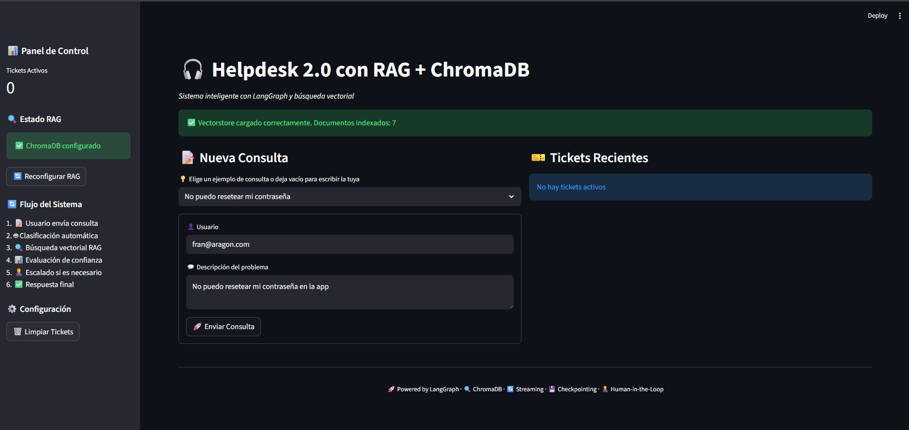
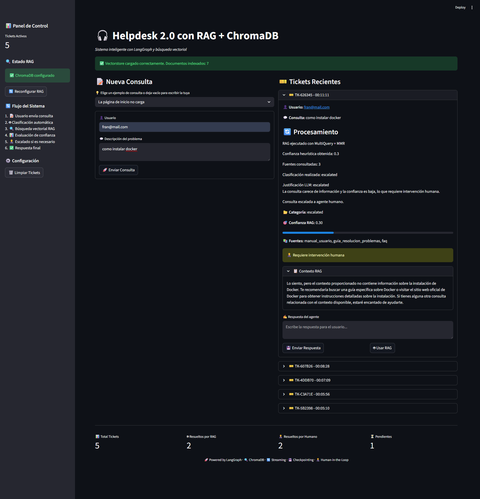

# 🎧 HELP DESK 2.0 CON IA (RAG)

## 📝 Descripción

Helpdesk inteligente basado en **Retrieval-Augmented Generation (RAG)**, especializado en soporte técnico y consultas de usuarios.

El sistema permite:

* 🔎 Recuperar información relevante usando búsqueda semántica avanzada.
* 🤖 Generar respuestas fundamentadas en documentos internos indexados.
* 💾 Mantener un **historial de tickets** y de pasos del procesamiento.
* 👨‍💼 Integrar un **flujo humano (Human-in-the-loop)** para escalado de consultas complejas.
* ✅ Control de confianza y fuentes consultadas.

Está diseñado con una arquitectura modular y extensible, pensado para **casos reales de soporte Helpdesk**.




---

## 🐍 Requisitos de Python

* Python 3.13.2 (recomendado, probado en macOS Apple Silicon y Windows)
* Python 3.11 (ideal para Mac Intel)

⚠️ No usar Python 3.14+, ya que rompe compatibilidad con:

* Pydantic
* ChromaDB
* LangChain Core

---

## 📂 Estructura del proyecto

```
/ia-helpdesk/
├── app/
│   ├── documents/              # Documentos de soporte iniciales (bootstrap opcional)
│   ├── loader.py               # Carga PDFs y otros documentos, los divide en chunks
│   ├── rag.py                  # Orquestación del pipeline RAG
│   ├── retrievers.py           # Construcción de retrievers (MMR, MultiQuery, Hybrid)
│   ├── vectorstore.py          # Creación y carga del vectorstore Chroma (persistente)
│   ├── prompts.py              # Prompts del sistema (RAG, clasificación)
│   ├── schemas.py              # Modelos Pydantic (HelpdeskState, HelpdeskStateModel)
│   ├── ui.py                   # Interfaz de usuario (Streamlit)
│   ├── bootstrap.py            # Inicialización segura de ChromaDB
│   ├── constants.py            # Constantes, ejemplos de consultas
│   ├── graph.py                # Definición y compilación del grafo LangGraph
│   └── services/
│       ├── llm_client.py       # Clientes LLM (OpenAI, Google, OpenRouter)
│       └── utils.py            # Utilidades (hash, env vars, UUIDs, etc.)
├── run_app.py                  # Punto de entrada de la aplicación
├── config_base.py              # Configuración global (modelos, paths, RAG)
├── requirements.txt            # Dependencias principales
├── requirements.lock           # Dependencias fijadas
└── .env                        # Variables de entorno
```

> Actualmente **no hay funcionalidad para subir nuevos documentos desde la UI**. Los documentos se cargan mediante `bootstrap.py` y desde el directorio `/documents` al iniciar la aplicación.

---

## 🧠 Arquitectura RAG (resumen)

### 🔹 Inicialización (bootstrap)

Documentos en /documents → load_documents() → create_vectorstore() → ChromaDB persistente en disco

> Solo se ejecuta si el vectorstore está vacío.

---

### 🔹 Flujo de consulta

Pregunta del usuario → Nodo RAG (query_rag) → Nodo Clasificación automática (auto vs escalado) →
Si es escalado → Nodo humano (Human-in-the-loop) → Nodo de generación de respuesta final → Respuesta + historial + confianza + fuentes

* Cada nodo puede devolver **historial parcial** que se acumula.
* Si la consulta requiere intervención humana, la ejecución se pausa hasta que un agente responda.
* El estado final se valida con Pydantic antes de guardar en sesión.

---

## 🚀 Instalación y uso

### 🔧 1) Crear entorno virtual

python -m venv .venv
source .venv/bin/activate      # macOS / Linux
.venv\Scripts\activate         # Windows

---

### 📦 2) Instalar dependencias

pip install -r requirements.txt
pip install -r requirements.lock

Para fijar nuevas dependencias:

pip freeze > requirements.lock

---

### 🔐 3) Configurar variables de entorno

cp .env.example .env

Editar `.env` con tus claves:

OPENAI_API_KEY=API_KEY_HERE
OPENROUTER_API_KEY=API_KEY_HERE
OPENROUTER_BASE_URL=[https://openrouter.ai/api/v1](https://openrouter.ai/api/v1)
ENV=dev

> Solo se usan las APIs que tengas configuradas; OpenAI y OpenRouter son opcionales según tu flujo.

---

### ▶️ 4) Ejecutar la aplicación

streamlit run run_app.py

Disponible en: [http://localhost:8501](http://localhost:8501)

---

## 🖥️ Uso de la interfaz

### 💬 Nueva consulta

* Escribe la consulta en el área de texto.
* Puedes elegir un ejemplo de consulta de la lista predefinida.
* Haz clic en **Enviar Consulta**.
* El sistema procesa la consulta paso a paso, mostrando el historial parcial.

### 🎫 Tickets recientes

* En la columna derecha se muestran los tickets activos.
* Cada ticket muestra:

  * Usuario
  * Consulta
  * Historial de procesamiento
  * Confianza del RAG
  * Fuentes consultadas
* Si se requiere intervención humana:

  * Se puede escribir una respuesta manual
  * O usar la respuesta RAG como base

### 📊 Estadísticas (footer)

* Total de tickets
* Resueltos por RAG
* Resueltos por humano
* Pendientes

---

## 🛠️ Desarrollo y extensibilidad

El proyecto está preparado para añadir:

* Filtrado o re-ranking avanzado
* Extracción de entidades (usuarios, fechas, IDs)
* Subida de nuevos documentos y reindexación incremental
* API REST con FastAPI
* Agentes personalizados o integración con otros flujos LangGraph

---

## 📌 Notas importantes

* ChromaDB es **persistente** (no se pierde información al reiniciar)
* Indexación incremental y segura
* Flujo de Human-in-the-loop implementado
* Evita duplicados en el vectorstore
* Historial de pasos accesible para cada ticket

---

## 📚 Recursos

* LangChain → [https://www.langchain.com/](https://www.langchain.com/)
* Streamlit → [https://streamlit.io/](https://streamlit.io/)
* ChromaDB → [https://www.trychroma.com/](https://www.trychroma.com/)
* Pydantic → [https://docs.pydantic.dev/](https://docs.pydantic.dev/)

---

